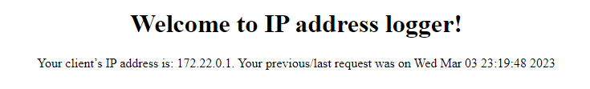
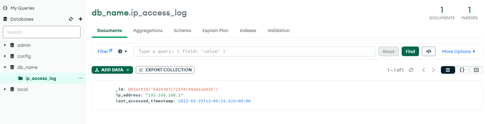
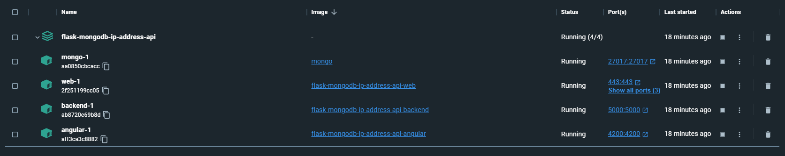
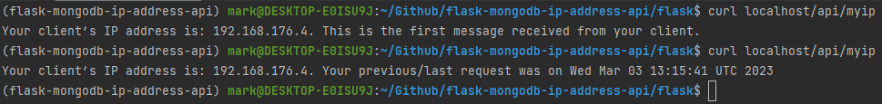
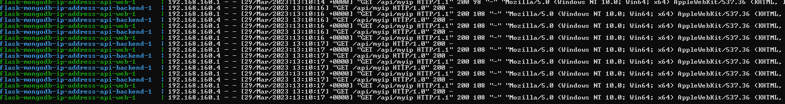

# flask-mongodb-ip-address-api
 An example IP logging app using Flask, Nginx and MongoDB

1. Angular 13 frontend
2. Nginx reverse proxy (forces SSL over TLS1.2)
3. FlaskAPI backend
4. MongoDB with authentication
### Requirements
Docker 4.17.0+ (untested on lower versions)
### Getting started (Win/Linux/Mac)
```
$ git clone git@github.com:nekosantk/flask-mongodb-ip-address-api.git
$ cd flask-mongodb-ip-address-api
$ sudo unzip env.zip .env
$ sudo unzip ssl_certs.zip -d nginx/ssl
$ docker compose up

Go to https://localhost
Accept self-signed certificate
Message should change on first refresh and display last accessed timestamp

Note: 
SSL certs go under nginx/ssl
Example env file included env.zip
Example SSL certs are in the ssl_certs.zip file (should replace or generate own ones)
All secrets/SSL certs should be dynamically inserted during the build process.
This can achieved through CI/CD and ENV files. 
They're included in this repo for ease of use.
```
### CI/CD using Jenkins
```
There is an untested Jenkinsfile that includes 4 steps
1. Build
2. Run
3. Test
4. Cleanup

The testing step grabs the local Docker gateway IP and does 2 curl requests
against the API and checks against expected responses. If either of the
responses fails or is incorrect the entire process will abort and the build
will fail.
```

### Logical flow
Entire system is made up of 4 Docker images which can be run at once using the docker-compose.yaml file.
```
Angular frontend -> Nginx proxy -> Flask API -> MongoDB
```

Redirects
```
Nginx redirects frontend from 80 -> 443
Nginx redirects frontend from 443 -> 4200
Nginx redirects API requests from 8000 -> 4000
```
Hosting ports
```
Angular is hosted on port   4200
Flask is hosted on port     4000
MongoDB is hosted on port   27017
```
Notes
```
Frontend is forced to use SSL over TLS1.2 with a self-signed certificate
```
 
### Screenshots

Angular\


MongoDB Compass


Docker Desktop


Backend requests


